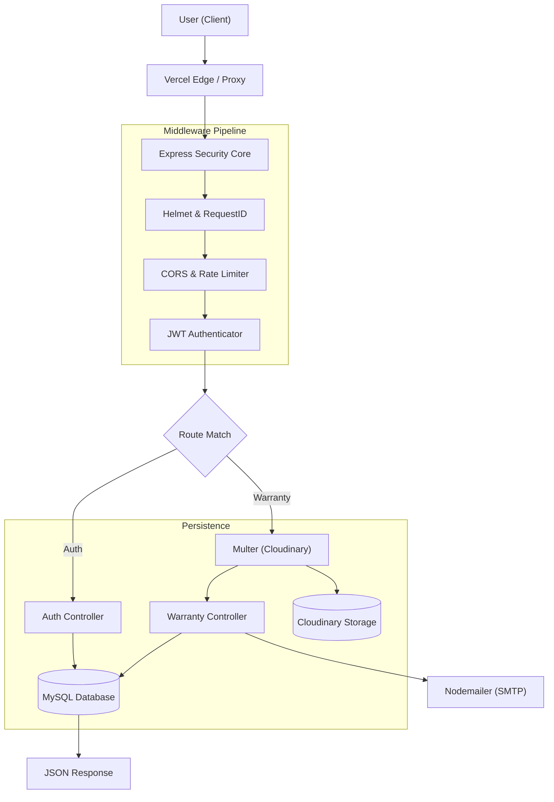

# 📊 Project Analysis & Security Audit: Warranty Portal

This report provides a comprehensive review of the current TypeScript architecture, security posture, and scalability outlook.

---

## 🏗️ 1. Architecture Mapping

The request lifecycle follows a multi-stage path from the client to persistent storage.

### 🔄 Full Request Lifecycle

### 🧠 Key Architecture Observations

| Component | Coupling Level | Vercel Serverless Impact |
| :--- | :--- | :--- |
| **Frontend Integration** | **High** | Requires exact matching for `product_details` JSON keys. |
| **Rate Limiting** | **Isolated** | Resets on cold starts; ineffective for distributed protection. |
| **File Handling** | **Decoupled** | Pre-processed by Multer; risk of storage growth bottlenecks. |
| **DB Pooling** | **Direct** | Connection exhaustion risk due to serverless concurrency. |

---

## 🛡️ 2. Security Audit & Integrity

> [!CAUTION]
> ### Critical Data Integrity Risk: Non-Transactional Writes
> Several operations (like `verifyOTP` and `submitWarranty`) perform multiple database writes across different tables sequentially. If the 3rd insert fails, the first two aren't rolled back, creating **"zombie"** data states.

### 🕵️ Vulnerability Matrix

| Area | Risk Level | Issue | Impact |
| :--- | :---: | :--- | :--- |
| **Auth Flow** | 🔴 Critical | `Math.random()` used for OTP generation. | Predictable codes (theoretical replay). |
| **Deletion** | 🔴 Critical | No soft-deletes or secondary confirmation. | Permanent customer data loss on one click. |
| **File Uploads** | 🟠 High | Missing `fileSize` limits in Multer. | Payload size/timeout denial of service. |
| **CORS** | 🟡 Medium | In-memory IP limiting. | Easily bypassed by spinning up proxies. |
| **Secrets** | 🟡 Medium | No rotation policy for `JWT_SECRET`. | Static secret risk if env leaks. |

---

## 📈 3. Scalability & Performance Review

### 💥 Stress Test Prediction
*Assuming 10k Customers | 50k Records | 100 Concurrent Logins*

1.  **DB Connection Wall**: 100 concurrent serverless functions could open up to 1,000 connections (10 per pool). Your MySQL instance will likely drop connections.
2.  **Dashboard Latency**: `getDashboardStats` runs 7 synchronous `COUNT(*)` queries. This will lag significantly as the primary table grows.
3.  **Grouping Bottlenecks**: The Customer report groups by email on the fly (O(N)). This will become a "heavy" query that slows down as data scales.

---

## 🛠️ 4. Infrastructure & Code Quality

> [!WARNING]
> **Type Safety Bypass**: Frequent use of `any` for database results (`const [rows]: any`) hides breaking schema changes until they cause runtime crashes.

### 📉 Code Health Check
- **Insecure Errors**: Silent error swallowing in some email service catch blocks.
- **Silent Growth**: The `pending_registrations` table only cleans up *on next registration*, leading to potential DB bloatedness.
- **Vercel Limits**: Multi-photo uploads (EV flow) may exceed the 10s default execution time on Hobby plans.

---

## 🗺️ 5. Priority Fix Roadmap

### 🔴 Phase 1: Critical Stability (High Urgency)
- [x] **Transactions**: Wrap all multi-stage writes in `db.beginTransaction()`. ✅ *Fixed in auth.controller.ts*
- [x] **OTP Security**: Switch to `crypto.randomInt()` for true randomness. ✅ *Fixed in otp.service.ts*
- [x] **Connection Guard**: Limit `connectionLimit` to `2` for Vercel functions. ✅ *Fixed in database.ts*

### 🟠 Phase 2: High Security & Logic
- [x] **Persistent Limiting**: Move rate limiting to Redis (Upstash). ✅ *Fixed in rateLimit.ts*
- [ ] **Soft Deletes**: Add `deleted_at` columns to avoid IRM (Irreversible Mistake). ⏳ *Deferred*
- [x] **File Protection**: Add strict `fileSize` limits (5MB) to Multer config. ✅ *Fixed in warranty.routes.ts*

### 🟡 Phase 3: Scalability & DX
- [ ] **Pre-aggregate Stats**: Use a cache or summary table for the Admin Dashboard. ⏳ *Deferred*
- [x] **Zod Enforcement**: Replace z.any() with proper typed schemas. ✅ *Fixed in schemas.ts*
- [ ] **Naming Cleanup**: Resolve `uid` vs `id` vs `registration_number` discrepancies. ⏳ *Deferred*

### 🔵 Additional Fixes (Added during audit)
- [x] **Email Retry**: Added retry with exponential backoff + admin alerts. ✅ *Fixed in email.service.ts*
- [x] **HTML Escaping**: Prevent XSS in email templates. ✅ *Fixed in email.service.ts*
- [x] **N+1 Query**: Optimized getManpower with JOIN. ✅ *Fixed in vendor.controller.ts*
- [x] **Configurable URLs**: Use env vars for BACKEND_URL/FRONTEND_URL. ✅ *Fixed in email.service.ts*
- [x] **Git Security**: Removed secrets from tracking, updated .gitignore. ✅

---

*Last updated: 2025-12-30*

