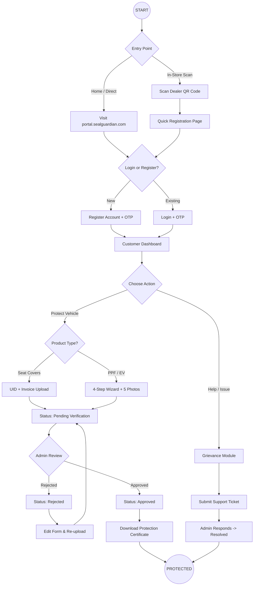
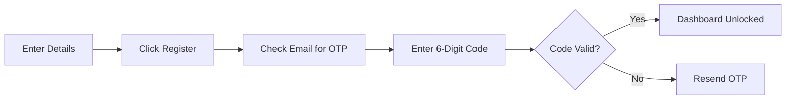

# 🛡️ Seal Guardian: The Complete Customer Manual
*Version 2.2 - Final Comprehensive Guide (with Master Flowchart)*

Welcome to the ultimate guide for the **Seal Guardian Warranty Portal**. This manual captures every detail of the car owner's journey, from scanning a dealer's QR code to holding your final protection certificate.

---

## 🗺️ The Master Customer Journey
*Below is the complete end-to-end flow of how the portal works for you.*

---

## 🧭 Table of Contents
1.  **[Module 1: Entry Points (QR vs. Web)](#module-1)**
2.  **[Module 2: Secure Identity (Auth)](#module-2)**
3.  **[Module 3: Your Dashboard](#module-3)**
4.  **[Module 4: Seat Cover Deep-Dive](#module-4)**
5.  **[Module 5: PPF & EV Wizard](#module-5)**
6.  **[Module 6: Rejections & Approvals](#module-6)**
7.  **[Module 7: Support & Grievances](#module-7)**
8.  **[The Mastery Checklist](#checklist)**

---

## 📱 Module 1: Entry Points (QR vs. Web)

### 1.1 The "Quick Scan" Experience
If you are at a dealership, look for the Seal Guardian QR Code.
1.  **Scan**: Use your camera.
2.  **Dealer Linked**: The portal auto-identifies the store (e.g., "Verified Franchise: Delhi Auto Mobiles").
3.  **Jumpstart**: You skip searching for the dealer and go straight to product selection.

### 1.2 Direct Web Access
If you are at home, visit [portal.sealguardian.com](https://portal.sealguardian.com). You will need to manually select your dealer from a list later.

---

## 📧 Module 2: Secure Identity (Auth)

### 2.1 The OTP Verification Flow

1.  **Identity**: Fill in your Name, Email, and 10-digit Mobile Number.
2.  **Verification**: We send a code to your **email** to ensure your warranty certificate is sent to the right person.

---

## 📊 Module 3: Your Dashboard

Your dashboard provides a high-level view:
*   **Total Protected Products**: Count of active warranties.
*   **Notifications**: Latest news about your car’s protection.
*   **Status List**: Overview of what’s Pending, Approved, or Rejected.

---

## 🛋️ Module 4: Seat Cover Deep-Dive

This module is for interior protection:
1.  **UID Number**: Locate the **16-digit sticker** on the product.
2.  **Installer**: Select the technician from the list.
3.  **Bill Upload**: Take a clear, flat photo of your invoice.

---

## 🚘 Module 5: PPF & EV Wizard

Exterior protection requires a 4-step photographic verification:
1.  **Vehicle Entry**: Enter Year, Make, Model, and Reg No.
2.  **The 5-Photo Rule**:
    *   📸 **Left Side Profile**
    *   📸 **Right Side Profile**
    *   📸 **Front** (Clear Number Plate)
    *   📸 **Back** (Clear Number Plate)
    *   📸 **Warranty Card** (With Dealer Stamp)

---

## 📜 Module 6: Rejections & Approvals

### 6.1 Understanding Rejections
If our team sees a blurry photo or wrong UID, the status turns **Red**.
*   **The Fix**: Click **"Edit"**, read the admin remarks, and re-upload only what is asked.

### 6.2 The Reward: Certification
Once **Green (Approved)**, your digital certificate is generated. It includes your vehicle ID, product details, and expiration date.

---

## 🛠️ Module 7: Support & Grievances

If there is a defect or service delay:
1.  Open **Grievances**.
2.  Attach photos of the issue.
3.  Track the admin status. Internal assignments (Staff A to Staff B) are hidden to maintain a professional workspace for you.

---

## ✅ The Mastery Checklist

| ⭐ THE "DOS" | 🚫 THE "DON'TS" |
| :--- | :--- |
| **Do** wait for the OTP email for 2 mins. | **Don't** use cropping on number plates. |
| **Do** check UID sticker vs screen entry. | **Don't** upload HEIC if you have slow net. |
| **Do** capture the whole car in profiles. | **Don't** share account access. |

---

**Technical Support**
📧 support@sealguardian.com
🌐 www.sealguardian.com

*© 2026 Seal Guardian. Excellence in Protection.*
