# 🏪 Seal Guardian: The Complete Franchise User Manual
*Version 2.0 - Exhaustive Operational Guide (with Master Flowchart)*

Welcome to the definitive guide for **Seal Guardian Authorized Franchises**. This manual is designed to empower your dealership with the tools to manage installations, marketing, and customer satisfaction with 100% efficiency.

---

## 🗺️ The Master Franchise Operations Flowchart
*The big picture: How you run your store within the Seal Guardian ecosystem.*

```mermaid
graph TD
    Start((FRANCHISE START)) --> Setup[Setup: Team & Profile]
    
    %% Phase 1: Setup
    Setup --> MngMan[Module 2: Manpower Control]
    Setup --> MngProf[Module 7: Profile & QR Setup]
    
    %% Phase 2: Operations
    MngMan --> DayToday{Daily Operations}
    MngProf --> DayToday
    
    %% Task 1: Warranty
    DayToday -- "New Sale" --> AssistReg[Module 3: Assisted Warranty Registration]
    AssistReg --> WType{Product Type?}
    WType -- "Seat Cover" --> SCForm[16-Digit UID Entry]
    WType -- "PPF / EV" --> PForm[4-Step Wizard + 5 Photos]
    
    SCForm --> Approval[Review Status: Pending -> Approved/Rejected]
    PForm --> Approval
    
    %% Task 2: Marketing
    DayToday -- "Need Banners/Stands" --> POSM[Module 4: POSM Requirements]
    POSM --> PReq[Request Marketing Material]
    PReq --> PTrack[Track: Open -> Production -> Dispatched]
    
    %% Task 3: Sales Enablement
    DayToday -- "Show Customer Products" --> Catalog[Module 5: Product Catalogue]
    Catalog --> Browse[Browse Specs & New Arrivals]
    
    %% Task 4: Intelligence
    DayToday -- "Check Performance" --> Home[Module 1: Dashboard Intelligence]
    Home --> Stats[Analyze: Approved vs. Rejected Counts]
    
    %% Feedback Loop
    Approval --> Feedback[Improve Technician Quality]
    Feedback --> DayToday
    
    %% End State
    DayToday -- "Issue Occurs" --> Grive[Module 8: Support & Grievances]
    Grive --> Resolution[Issue Resolved]
```

---

## 🧭 Table of Contents
1.  **[Module 1: Dashboard & Intelligence](#module-1)**
2.  **[Module 2: Manpower Control (Team Management)](#module-2)**
3.  **[Module 3: Assisted Warranty Registration](#module-3)**
4.  **[Module 4: POSM & Marketing Requirements](#module-4)**
5.  **[Module 5: Product Catalogue (Sales Tool)](#module-5)**
6.  **[Module 6: News & Alerts](#module-6)**
7.  **[Module 7: Profile & Growth Tools (Store QR)](#module-7)**
8.  **[Module 8: Support & Grievances](#module-8)**
9.  **[The Franchise Handbook (Dos & Don’ts)](#handbook)**

---

## 📊 Module 1: Dashboard & Intelligence
Your home screen provides real-time "Intelligence" for your store.

### 1.1 The Scorecard
*   **Total Warranties**: Every registration attempt connected to your store.
*   **Approved (🟢)**: Successful installations that verified your team's quality.
*   **Pending (🟡)**: Warranties awaiting a final check by the Admin.
    *   *Note: As a franchise, you can pre-approve installations done by your team to speed up the process.*
*   **Manpower Count**: Number of active technicians in your team.

### 1.2 Recent Activity
A live feed of the latest registrations, approvals, and rejections. Use this to spot immediate issues in installation quality.

---

## 👥 Module 2: Manpower Control (Team Management)
*This is the heart of your store operations.*

### 2.1 Why Manage Manpower?
Every warranty registration requires an **Installer ID**. By managing your team here, you can track exactly which technician is performing best and who needs more training.

### 2.2 Adding a Technician
1.  Go to **Manpower Control**.
2.  Click **"Add Installer"**.
3.  Enter their **Full Name**, **Phone Number**, and **Role** (Lead or Assistant).
4.  **Technician ID**: The system generates a unique ID (e.g., ADIT123). This must be used during warranty registration.

### 2.3 Performance Tracking

---

## 📝 Module 3: Assisted Warranty Registration
If a customer is unable to register, you can do it for them.

### 3.1 Registration Workflow
1.  Select **"Register New Warranty"**.
2.  Choose the **Product Type** (Seat Cover or PPF/EV).
3.  **The Installer ID**: Select the technician who did the job from your pre-saved list.
4.  **Customer Details**: Enter the customer’s Name, 10-digit Phone, and Email.
5.  **Vehicle & Photos**: 
    *   For Seat Covers: 16-Digit UID and Invoice Photo.
    *   For PPF/EV: 4-Step wizard with 5 Mandatory Photos (LHS, RHS, Front, Back, Warranty Card).

---

## 📦 Module 4: POSM & Marketing Requirements
Keep your store looking premium with official Seal Guardian materials.

### 4.1 Requesting Material
1.  Navigate to **POSM Requirements**.
2.  Click **"New Request"**.
3.  Select items: Banners, Standees, Catalogues, Stickers, etc.
4.  Describe your requirement (e.g., "Need 2 Large Exterior Banners for Diwali").

### 4.2 Tracking the Lifecycle

---

## 📖 Module 5: Product Catalogue (Sales Tool)
Showcase the full range to your customers directly from your tablet or screen.

### 5.1 Using the Catalogue
*   **Filters**: Quickly find products for 4-wheelers vs. 2-wheelers.
*   **Spotlight**: See "New Arrivals" and "Best Sellers" to recommend the best products.
*   **Technical Specs**: Access "Why Choose Autoform" and specific product certifications to build customer trust.

---

## 🔔 Module 6: News & Alerts
Stay updated with official communication.
*   **System Alerts**: Notifications about portal maintenance or new features.
*   **Product Launches**: Be the first to know about new material releases.
*   **Announcements**: Direct messages from the Seal Guardian Head Office.

---

## ⚙️ Module 7: Profile & Growth Tools (Store QR)

### 7.1 Your Digital Identity
View your **Store Code**, **Store Email**, and **Contact Person** details.

### 7.2 The Growth Tool: Store QR
This is local marketing at its best.
1.  Download your unique **Store QR Code**.
2.  Print it and place it at your reception.
3.  When a customer scans it, the warranty they register is **automatically linked to your store**. This ensures you get the credit and tracking for every sale without manual entry.

---

## 🛠️ Module 8: Support & Grievances
Submit issues regarding product quality, delivery delays, or portal technicalities.
*   **Create Ticket**: Attach photos of damaged goods or screenshots of errors.
*   **Response History**: View the ongoing conversation with the Admin team to resolve the issue.

---

## ✅ The Franchise Handbook (Dos & Don’ts)

| ⭐ THE "DOS" (Operational Excellence) | 🚫 THE "DON'TS" (Common Failures) |
| :--- | :--- |
| **Do** keep your manpower list updated. Deactivate staff who leave. | **Don't** register warranties under the wrong technician ID. |
| **Do** ensure your installers take photos in bright daylight. | **Don't** use dummy email addresses for customers. |
| **Do** encourage customers to scan the **Store QR** for faster flow. | **Don't** ignore "Rejected" warranties; fix them immediately. |
| **Do** check POSM status regularly to receive materials on time. | **Don't** upload blurry invoice photos. |

---

**Franchise Support Channel**
📧 dealer-support@sealguardian.com
🏢 Noida Head Office, India

*Scaling Your Business with Quality & Trust.*
*© 2026 Seal Guardian India.*
