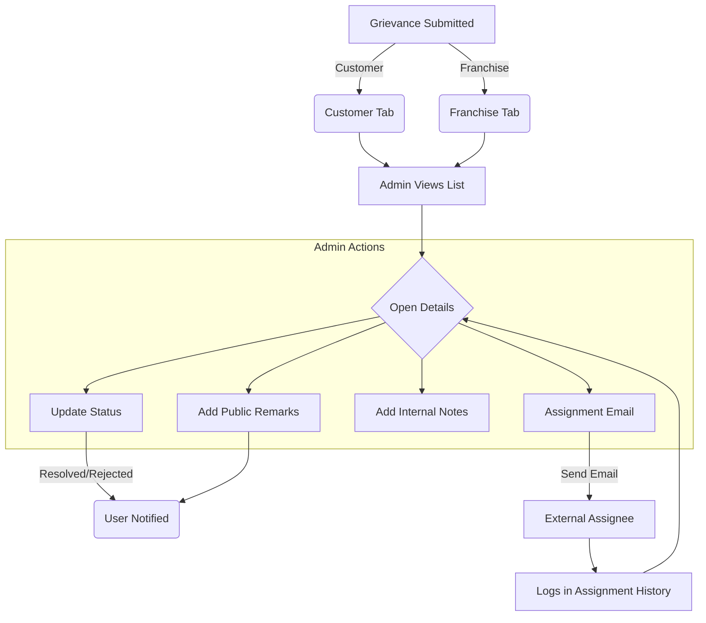

# Grievance System Analysis - Admin Side

## Current Workflow Chart

## Existing Databases/Tables

- **`grievances`**: Stores core ticket data (ticket_id, category, subject, description, status, assigned_to, etc.)
- **`grievance_remarks`**: History of public remarks added by Admin or Vendor.
- **`grievance_assignments`**: history of external assignment emails sent.

## Assignment Logic (Current)

1. **Assignee Details**: Admin enters Name and Email of the person responsible.
2. **Email Delivery**: System sends a detailed email to the assignee with the grievance description and attachments.
3. **Tracking**: 
    - The `assigned_to` field on the main ticket reflects the current assignee name.
    - Multiple "Follow-up" assignments can be sent to different people or the same person.
    - Status remains managed by the Admin.

## Observations for Enhancement

- Assignments are currently **email-only**; there is no "Assignee Dashboard" or "Assignee Portal".
- Assignments don't have a "Due Date" or "Priority Level" specific to the assignee.
- There is no automated follow-up system if the assignee doesn't respond.
- Assignment history is visible but static (can't delete/re-assign without sending a new email).

---

> [!NOTE]
> I have analyzed the current implementation. I am ready to implement the "few things in assignments" and the "one more thing" you have in mind. Please specify what additions you'd like to see!
