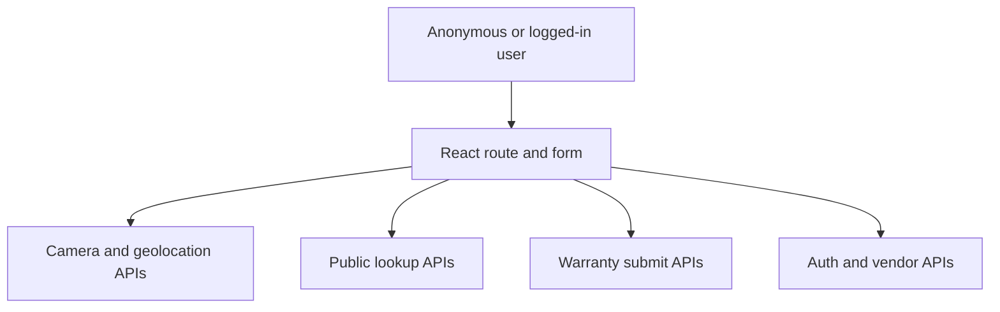

# SeatCoverForm Threat Model

## Executive summary
`SeatCoverForm` is a React/Vite browser-side warranty-registration flow that supports both authenticated users and an anonymous QR-based public route. The highest-risk themes are integrity abuse of the public submission path, privacy exposure from collecting PII plus precise location/device metadata, and backend-facing file-upload abuse where the only visible validation in this repo is client-side. The most security-relevant code paths are the anonymous `/connect/:storeCode` flow, multipart submission to `/public/warranty/submit`, the uniqueness-check APIs, and the authenticated token boundary used by vendor/customer flows.

## Scope and assumptions
- In scope: `src/components/warranty/SeatCoverForm.tsx`, plus immediate runtime dependencies that define its trust boundaries and data flows:
  - `src/pages/public/ConnectStorePage.tsx`
  - `src/components/ui/CameraCapture.tsx`
  - `src/lib/imageCompression.ts`
  - `src/lib/warrantyApi.ts`
  - `src/lib/api.ts`
  - `src/contexts/AuthContext.tsx`
  - `src/App.tsx`
- Out of scope: backend route handlers, storage, database policy, email/OTP delivery, infrastructure/WAF configuration, and CI/build tooling beyond noting this is a Vite React app (`package.json`).
- Assumptions:
  - The route `/connect/:storeCode` is intentionally internet-accessible for anonymous end users (`src/App.tsx:81-84`, `src/pages/public/ConnectStorePage.tsx:24-45`).
  - The backend API at `VITE_API_URL` or the hardcoded production base URL is shared by both public and authenticated flows (`src/lib/api.ts:7-18`, `src/lib/api.ts:23-30`).
  - Warranty submissions persist customer PII, vehicle identifiers, uploaded invoice/images, and the optional `exifData` object created client-side (`src/components/warranty/SeatCoverForm.tsx:358-385`, `src/components/warranty/SeatCoverForm.tsx:398-429`).
  - Server-side validation, authorization, rate limiting, malware scanning, and storage isolation may exist, but there is no evidence for those controls in this frontend repo.
- Open questions that would materially change ranking:
  - Does `/public/warranty/submit` enforce server-side schema validation, UID validation, store-code binding, file-type sniffing, malware scanning, and rate limiting?
  - Is `exifData` required for fraud detection, and what are its retention, access-control, and minimization rules?
  - Are store codes high-entropy secrets or short human-readable identifiers intended only for convenience?

## System model
### Primary components
- Browser UI: `SeatCoverForm` collects customer PII, vehicle data, product UID, and four file uploads, then submits them either through authenticated warranty APIs or the anonymous public API (`src/components/warranty/SeatCoverForm.tsx:237-515`).
- Public QR entrypoint: `ConnectStorePage` resolves `storeCode`, fetches store details and products from public endpoints, and renders `SeatCoverForm` with `isPublic={true}` (`src/pages/public/ConnectStorePage.tsx:24-86`, `src/pages/public/ConnectStorePage.tsx:179-185`).
- Browser device APIs: `CameraCapture` can invoke mobile capture or desktop `getUserMedia`, and `SeatCoverForm` additionally calls `navigator.geolocation.getCurrentPosition` and `exifr.parse` to assemble `exifData` (`src/components/ui/CameraCapture.tsx:82-118`, `src/components/warranty/SeatCoverForm.tsx:593-623`, `src/components/warranty/SeatCoverForm.tsx:669-717`).
- Auth/token layer: authenticated flows rely on a bearer token stored in `localStorage`, attached by Axios interceptors, and refreshed via `/auth/me` (`src/contexts/AuthContext.tsx:47-61`, `src/contexts/AuthContext.tsx:79-87`, `src/lib/api.ts:36-40`).
- API client/submission wrappers: public and authenticated submissions both build multipart payloads client-side; `warrantyApi.ts` also logs payload details in debug statements (`src/components/warranty/SeatCoverForm.tsx:398-429`, `src/lib/warrantyApi.ts:4-146`).

### Data flows and trust boundaries
- Internet user -> Public route `/connect/:storeCode`
  - Data: URL path parameter `storeCode`.
  - Channel: HTTPS browser route with React Router.
  - Security guarantees: none visible beyond route structure; no auth required (`src/App.tsx:81-84`).
  - Validation: missing/invalid code is handled in UI after a public API lookup (`src/pages/public/ConnectStorePage.tsx:35-45`, `src/pages/public/ConnectStorePage.tsx:91-107`).
- Browser form -> Public lookup APIs
  - Data: store code, product list requests, store manpower requests, uniqueness probes for phone and registration number.
  - Channel: Axios over HTTPS using unauthenticated GETs.
  - Security guarantees: none visible in this repo; no CSRF token or auth token required for these calls (`src/pages/public/ConnectStorePage.tsx:43-45`, `src/components/warranty/SeatCoverForm.tsx:543-571`).
  - Validation: client-side length gates only; phone requires 10 digits, registration check waits for 6+ chars and 800 ms debounce (`src/components/warranty/SeatCoverForm.tsx:542-572`).
- Browser form -> Device APIs
  - Data: camera frames, file blobs, geolocation coordinates, EXIF metadata including timestamp/device model.
  - Channel: browser `getUserMedia`, file input, `navigator.geolocation`, `exifr`.
  - Security guarantees: browser permission prompts for camera and geolocation; no app-specific consent or minimization evidence beyond permission prompts (`src/components/ui/CameraCapture.tsx:82-118`, `src/components/warranty/SeatCoverForm.tsx:669-688`).
  - Validation: file MIME allow-list and 5 MB size cap are client-side only (`src/components/warranty/SeatCoverForm.tsx:576-650`).
- Browser form -> Public submit API
  - Data: customer PII, vehicle registration, product UID, store/manpower identifiers, invoice, three photos, and `exifData`.
  - Channel: multipart form-data POST to `/public/warranty/submit`.
  - Security guarantees: none visible in client other than HTTPS assumption; no auth token attached by design for anonymous flow.
  - Validation: client enforces required fields and simple formatting; comments explicitly say the public path skips pre-submit UID validation and relies on the server during submission (`src/components/warranty/SeatCoverForm.tsx:242-333`, `src/components/warranty/SeatCoverForm.tsx:398-429`, `src/components/warranty/SeatCoverForm.tsx:993-999`).
- Authenticated browser -> Authenticated API endpoints
  - Data: bearer token, customer/vendor autofill fields, vendor profile, manpower list, warranty submission data.
  - Channel: Axios over HTTPS with `Authorization: Bearer <token>` and `withCredentials: true`.
  - Security guarantees: token-based auth; token is persisted in `localStorage` and attached to each request (`src/lib/api.ts:29`, `src/lib/api.ts:37-39`, `src/contexts/AuthContext.tsx:85-86`).
  - Validation: server-side auth expected but not visible here; UI autofills some fields from `/vendor/profile` and `/auth/me` (`src/components/warranty/SeatCoverForm.tsx:103-137`, `src/contexts/AuthContext.tsx:56-61`).

#### Diagram

## Assets and security objectives
| Asset | Why it matters | Security objective (C/I/A) |
| --- | --- | --- |
| Customer PII (`customerName`, `customerEmail`, `customerMobile`) | Identifies end users and can trigger privacy, spam, and impersonation harm | C, I |
| Vehicle registration number | Uniquely ties a warranty to a vehicle and can be used for tracking or fraud | C, I |
| Uploaded invoice and photos | Contain proof-of-purchase and vehicle evidence; may also carry hidden metadata or active content | C, I, A |
| `exifData` (GPS, timestamp, device make/model) | Precise location/device metadata raises privacy sensitivity and may influence fraud decisions | C, I |
| Warranty record integrity (UID, product, store, manpower, vendorDirect) | Drives claim validity, franchise attribution, and downstream support/financial workflows | I |
| Auth token in `localStorage` | Grants access to authenticated vendor/customer flows if stolen | C, I |
| Availability of public lookup and submit endpoints | Abuse can block real registrations and increase operational cost | A |

## Attacker model
### Capabilities
- Unauthenticated internet user can browse the public route, call any public endpoint used by the form, and bypass all client-side checks by sending crafted HTTP requests directly.
- Authenticated customer or vendor can tamper with requests in the browser devtools, including fields that are normally autofilled or hidden behind UI logic.
- Attacker can upload arbitrary files and arbitrary JSON values unless the backend rejects them; the browser allow-list is not a server control.
- Attacker can automate high-volume probes against the uniqueness-check and store-code lookup endpoints if those endpoints are internet-facing as the routing suggests.

### Non-capabilities
- No evidence in this repo that the client executes uploaded files or renders user-supplied HTML in `SeatCoverForm`; classic stored-XSS from this component alone is not the primary concern.
- No evidence in this repo of direct database access, server-side template rendering, or privileged local file-system access from the browser.
- This model does not assume compromise of browser permission prompts; camera/geolocation access still depends on user/browser consent.

## Entry points and attack surfaces
| Surface | How reached | Trust boundary | Notes | Evidence (repo path / symbol) |
| --- | --- | --- | --- | --- |
| Public QR route | `GET /connect/:storeCode` | Internet -> browser route | Anonymous entrypoint into store-bound registration flow | `src/App.tsx:81-84`, `src/pages/public/ConnectStorePage.tsx:24-45` |
| Store lookup | `api.get(/public/stores/code/${storeCode})` | Browser -> public API | Returns store details and installers for anonymous users | `src/pages/public/ConnectStorePage.tsx:43-60` |
| Public uniqueness checks | `api.get(/public/warranty/check-uniqueness...)` | Browser -> public API | Reveals whether phone/reg appears already registered | `src/components/warranty/SeatCoverForm.tsx:542-572` |
| UID validation | `api.get(/uid/validate/${uid})` | Authenticated browser -> API | Skipped in public flow before submit | `src/components/warranty/SeatCoverForm.tsx:993-1005` |
| Public warranty submission | `api.post('/public/warranty/submit', formDataPayload)` | Browser -> public API | Main anonymous multipart upload path | `src/components/warranty/SeatCoverForm.tsx:398-429` |
| Authenticated warranty submission | `submitWarranty()` / `updateWarranty()` | Authenticated browser -> API | Uses bearer token and multipart payloads | `src/components/warranty/SeatCoverForm.tsx:387-447`, `src/lib/warrantyApi.ts:4-146` |
| Camera/geolocation/EXIF processing | `CameraCapture`, `navigator.geolocation`, `exifr.parse` | Browser -> device/browser APIs | Collects photos plus optional GPS/device metadata | `src/components/ui/CameraCapture.tsx:82-118`, `src/components/warranty/SeatCoverForm.tsx:593-623`, `src/components/warranty/SeatCoverForm.tsx:669-717` |
| Auth token persistence | `localStorage` + Axios interceptor | Browser storage -> authenticated API | Token attached to all API calls after OTP verification | `src/contexts/AuthContext.tsx:79-87`, `src/lib/api.ts:36-40` |

## Top abuse paths
1. Attacker discovers or guesses a valid `storeCode`, opens `/connect/:storeCode`, forges customer/vehicle/UID fields, uploads fabricated invoice/photos, and submits a fraudulent warranty to create or poison claim records.
2. Attacker skips the UI completely and posts directly to `/public/warranty/submit` with tampered `installerName`, `installerContact`, `manpowerId`, `vendorDirect`, or `exifData` values to misattribute a claim or bypass intended flow constraints.
3. Attacker scripts `/public/warranty/check-uniqueness?phone=...` and `?reg=...` to learn whether specific phone numbers or vehicle registrations are already present, then uses that knowledge for targeted fraud or privacy harm.
4. Attacker automates `storeCode` lookups against `/public/stores/code/:storeCode` to enumerate valid stores and harvest store emails/contact details or target specific franchises.
5. Attacker uploads malformed or weaponized files directly to the public submit endpoint, bypassing client MIME and size checks, hoping to exploit backend parsers, storage processors, or antivirus gaps.
6. Attacker floods public lookup and multipart submission endpoints with automated requests and large payloads, degrading availability for real customers and increasing storage/processing cost.
7. Legitimate user unknowingly grants camera/geolocation access; the app collects GPS plus device metadata and sends it with warranty data, creating a privacy-sensitive dataset with unclear consent and retention boundaries.

## Threat model table
| Threat ID | Threat source | Prerequisites | Threat action | Impact | Impacted assets | Existing controls (evidence) | Gaps | Recommended mitigations | Detection ideas | Likelihood | Impact severity | Priority |
| --- | --- | --- | --- | --- | --- | --- | --- | --- | --- | --- | --- | --- |
| TM-001 | Anonymous internet attacker | Valid or guessable `storeCode`; public API reachable | Submit forged warranty claims through the anonymous flow or direct API requests | Fraudulent warranties, support overhead, integrity loss in claim records | Warranty integrity, store/manpower attribution, uploaded evidence | Client requires terms, key fields, and mandatory files before submit (`src/components/warranty/SeatCoverForm.tsx:242-333`); public route must first resolve a store (`src/pages/public/ConnectStorePage.tsx:43-60`) | Controls are client-side and bypassable; no repo evidence of backend store-code binding, CAPTCHA, rate limiting, or duplicate/UID enforcement on public submit | Enforce server-side schema and business-rule validation; bind submissions to server-resolved store identity, not client-supplied strings; add CAPTCHA/rate limits and duplicate detection; reject claims where UID/store/manpower mapping is inconsistent | Alert on high submit volume per IP/store, repeated UID failures, abnormal installer/manpower combinations | High | High | high |
| TM-002 | Anonymous or authenticated attacker tampering requests | Ability to send direct HTTP requests or modify browser requests | Override `installerName`, `installerContact`, `manpowerId`, `vendorDirect`, or `productType` in submission payloads | Misattributed warranties, reporting corruption, possible authorization bypass if backend trusts client fields | Warranty integrity, vendor/store records | Vendor/public flows autofill installer fields from trusted lookups (`src/components/warranty/SeatCoverForm.tsx:103-137`, `src/components/warranty/SeatCoverForm.tsx:178-190`) | Payload still carries mutable business-critical fields supplied by the browser (`src/components/warranty/SeatCoverForm.tsx:358-385`, `src/components/warranty/SeatCoverForm.tsx:401-425`) | Derive store/vendor/manpower identity server-side from auth context or store code; ignore client-supplied privileged fields; sign or issue one-time public enrollment tokens if QR binding matters | Log mismatches between auth/store context and submitted installer fields; flag rare `vendorDirect` usage | Medium | High | high |
| TM-003 | Anonymous scraper or targeted fraud actor | Public endpoint access | Enumerate `phone`, `reg`, and `storeCode` values via public lookup APIs | Privacy leakage, targeted fraud, store enumeration | Customer PII, vehicle identifiers, store details, endpoint availability | Phone check waits for 10 digits; reg check has 800 ms debounce and 6-char threshold (`src/components/warranty/SeatCoverForm.tsx:542-572`) | No auth, no client evidence of rate limiting, and responses appear to reveal existence/non-existence | Add server-side rate limits, IP/device throttling, and generic responses; consider moving uniqueness feedback after authenticated or challenge-protected steps | Monitor high-cardinality lookup bursts, repeated sequential store codes, and enumeration-like query patterns | High | Medium | high |
| TM-004 | Any attacker able to upload files | Public or authenticated submit path reachable | Upload malicious or oversized files directly to submit endpoints, bypassing browser allow-list and compression | Backend parser exploitation, storage abuse, malware handling risk, availability degradation | Uploaded evidence, backend availability, downstream processors | Client checks MIME allow-list and 5 MB size, and compresses images in-browser (`src/components/warranty/SeatCoverForm.tsx:576-650`, `src/components/warranty/SeatCoverForm.tsx:720-731`) | No server-side file-validation evidence in repo; client checks do not constrain direct HTTP requests | Enforce server-side MIME sniffing, extension/content validation, size limits, quarantine/AV scanning, and isolated object storage; avoid parsing uploads synchronously in request path | Track upload rejections by MIME mismatch, unusually large files, parse failures, and scan verdicts | Medium | High | high |
| TM-005 | Legitimate user, insider, or attacker abusing public flow | User grants permissions or uploads photos | Collect and submit GPS/device metadata with warranty data, while debug logs expose portions of that metadata and payload details in browser console | Excessive sensitive-data collection, privacy/regulatory risk, broader breach impact if backend is compromised | `exifData`, customer PII, uploaded evidence | Browser permission prompts for camera/geolocation; EXIF extraction is intentional for fraud detection (`src/components/warranty/SeatCoverForm.tsx:593-623`, `src/components/warranty/SeatCoverForm.tsx:669-717`) | No explicit in-app consent or minimization for GPS/device metadata; debug logs print payload/exif details (`src/components/warranty/SeatCoverForm.tsx:408`, `src/components/warranty/SeatCoverForm.tsx:601-623`, `src/lib/warrantyApi.ts:5-146`) | Add explicit notice and separate consent for location/device metadata if required; minimize fields, strip logs in production, and define retention/access rules server-side | Audit when geolocation is collected, monitor access to EXIF-bearing records, and block production debug logging | Medium | Medium | medium |
| TM-006 | Botnet or low-skill automated attacker | Public endpoints internet-accessible | Flood public lookups and multipart submissions to exhaust backend/API/storage capacity | Slower or failed registrations for real users; operational cost | Public API availability, storage, support capacity | Minor client throttling on vehicle-reg lookups and client file-size limits (`src/components/warranty/SeatCoverForm.tsx:557-572`, `src/components/warranty/SeatCoverForm.tsx:644-650`) | Client throttles do not protect the backend; no evidence of edge/WAF/rate-limit controls in repo | Add per-IP and per-store rate limits, request body caps, async upload handling, and abuse challenges on public routes | Alert on upload error spikes, request-rate anomalies, and sudden store-specific traffic concentrations | High | Medium | high |

## Criticality calibration
- `critical` in this context means a flaw that would likely allow broad unauthorized creation/modification of warranty records or backend compromise from the public upload surface with minimal attacker friction.
  - Example: public-submit authz bypass that lets anyone register warranties for arbitrary stores at scale.
  - Example: malicious upload path leading to backend code execution or cross-tenant storage compromise.
- `high` means realistic internet-reachable abuse that materially harms data integrity, privacy, or availability even if it does not produce immediate full-system compromise.
  - Example: mass enumeration of phone/vehicle/store existence through public lookups.
  - Example: direct request tampering that changes store/manpower attribution if the backend trusts client fields.
  - Example: sustained public upload flooding that blocks real customer registrations.
- `medium` means meaningful but more bounded harm, usually dependent on deployment choices, retention practices, or a secondary weakness.
  - Example: over-collection of GPS/device metadata where access is otherwise controlled.
  - Example: exposure of sensitive payload details through browser debug logs or support-session sharing.
  - Example: single-store code discovery when store codes are already intentionally public.
- `low` means issues that are mostly UX or defense-in-depth if the backend already enforces the true security boundary.
  - Example: bypassing browser-side field restrictions that the server revalidates correctly.
  - Example: product-catalog or generic store metadata being retrievable from intentionally public endpoints.

## Focus paths for security review
| Path | Why it matters | Related Threat IDs |
| --- | --- | --- |
| `src/components/warranty/SeatCoverForm.tsx` | Core data collection, public submit logic, uniqueness checks, and EXIF/geolocation handling all live here | TM-001, TM-002, TM-003, TM-004, TM-005, TM-006 |
| `src/pages/public/ConnectStorePage.tsx` | Defines the anonymous store-code entrypoint and public lookup sequence that gates the QR flow | TM-001, TM-003, TM-006 |
| `src/lib/warrantyApi.ts` | Builds authenticated multipart payloads and currently logs detailed payload data to console | TM-002, TM-004, TM-005 |
| `src/lib/api.ts` | Shows token attachment, public/authenticated API boundary, and session handling model | TM-002 |
| `src/contexts/AuthContext.tsx` | Persists the bearer token in `localStorage` and refreshes authenticated identity | TM-002 |
| `src/components/ui/CameraCapture.tsx` | Controls camera-only capture behavior and desktop webcam access | TM-004, TM-005 |
| `src/lib/imageCompression.ts` | Client-side compression is part of the upload trust boundary but not a security control for direct API abuse | TM-004, TM-006 |
| `src/components/admin/modules/AdminVendorDetails.tsx` | Admin-managed `store_code` generation/assignment influences how guessable and abuse-resistant the public QR flow is | TM-001, TM-003 |

## Quality check
- Covered discovered entry points: public route, public store/product/manpower lookups, uniqueness checks, UID validation, public submit, authenticated submit, camera/geolocation/EXIF, and auth-token attachment.
- Represented each trust boundary in the threat set: Internet -> public route/API, browser -> device APIs, authenticated browser -> API, and browser storage -> API.
- Runtime vs CI/dev separation: report is limited to runtime/frontend paths; build tooling is out of scope except noting Vite/React from `package.json`.
- User clarifications: none provided; assumptions remain explicit and drive several rankings.
- Assumptions and open questions are called out in the scope section and influence whether the top issues remain `high` versus drop to `medium`.
